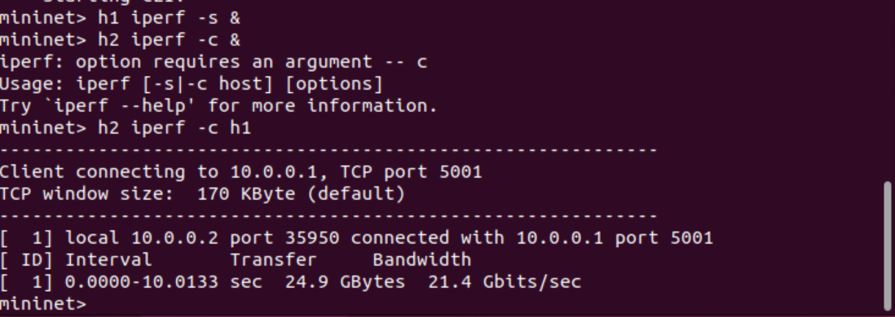
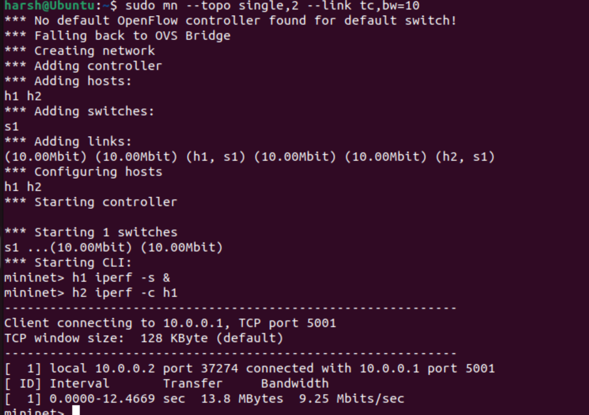
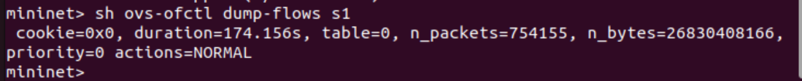

# Bandwidth Measurement and Analysis using Mininet (SDN)

## Problem Statement
To measure and analyze bandwidth using Mininet.

## Objective
- Measure bandwidth using iperf
- Analyze network performance

## Methodology
'''
sudo mn --topo single,2
pingall
h1 iperf -s &
h2 iperf -c h1
'''

## Results
| Scenario | Bandwidth |
|----------|----------|
| Normal | ~21.4 Gbps |
| Limited | ~9.25 Mbps |

## Analysis
The results show that bandwidth decreases when network constraints are applied. 
In the normal scenario, throughput is very high because Mininet runs on a single system. 
When bandwidth is limited using tc (10 Mbps), the observed throughput reduces to around 9.25 Mbps.

## Screenshots

### Ping

### iperf Normal

### iperf Limited

### Flow Table

## ROI (Observations)

- Throughput depends on bandwidth limitations.
- In the normal scenario, very high bandwidth is observed due to virtual environment.
- When bandwidth is limited to 10 Mbps, throughput reduces to around 9.25 Mbps.
- This demonstrates that network performance can be controlled using SDN.
## Flow Table Analysis

The command `ovs-ofctl dump-flows s1` shows the flow entries in the switch. 
The action `NORMAL` indicates default forwarding behavior. 
The packet count confirms that traffic is flowing correctly.