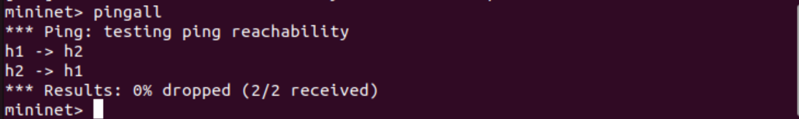
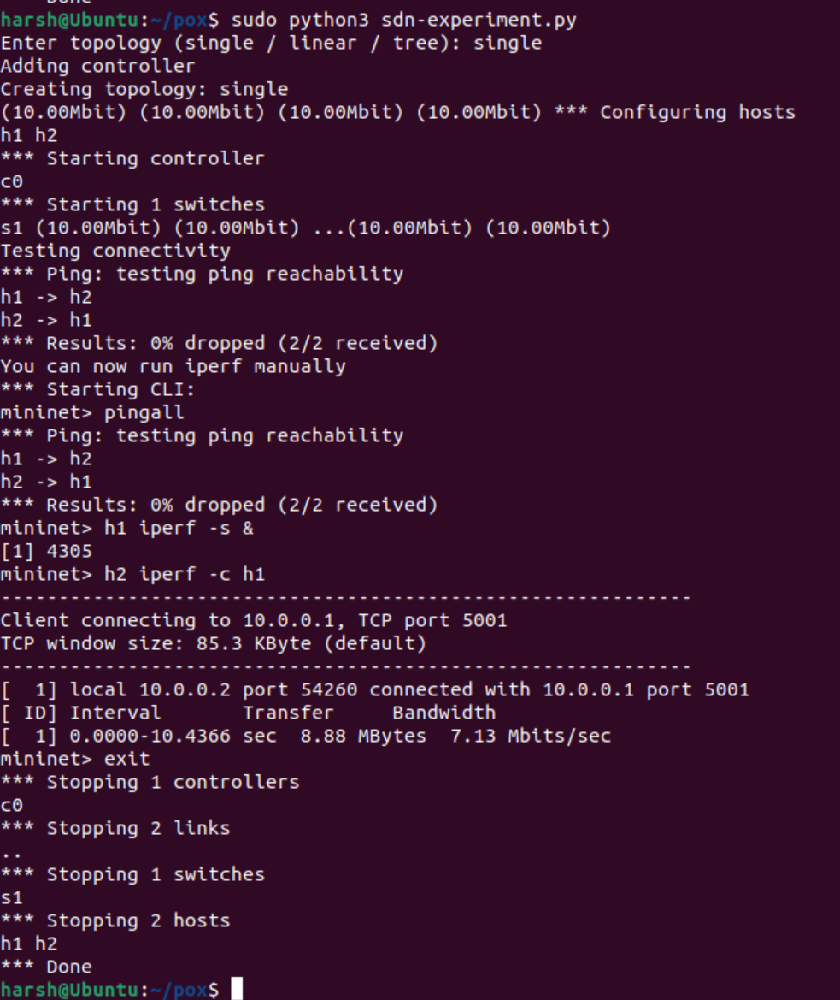
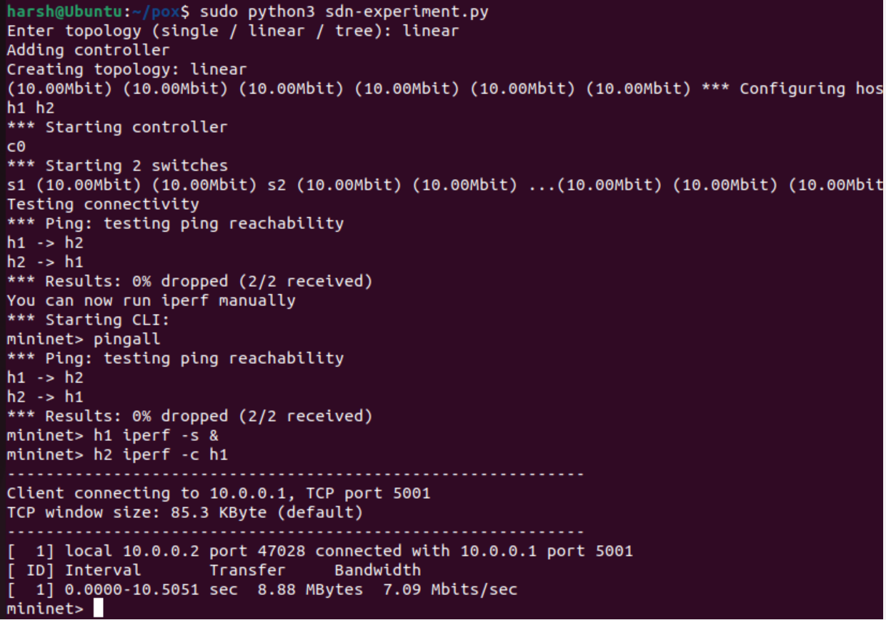
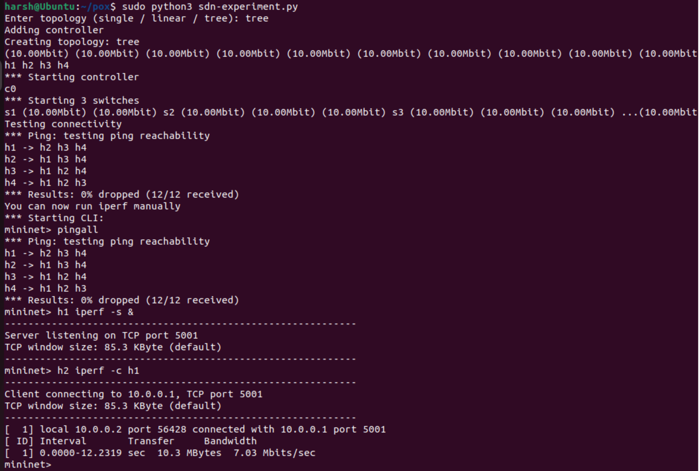
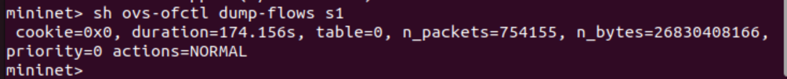

# Bandwidth Measurement and Performance Analysis using Mininet and SDN

## Problem Statement

To measure and analyze network bandwidth and performance using Software Defined Networking (SDN) in Mininet.

---

## Objective

* Measure network throughput using `iperf`
* Analyze network performance in different topologies
* Compare throughput across multiple topologies
* Study the effect of bandwidth limitation on performance
* Observe OpenFlow switch flow entries

---

## Tools and Technologies Used

* Ubuntu Linux
* Mininet
* POX SDN Controller
* Open vSwitch (OVS)
* iperf
* Python

---

## Methodology

### Step 1: Start the POX Controller

```bash id="1q8z7x"
cd pox
./pox.py forwarding.l2_learning
```

---

### Step 2: Run the SDN Experiment

```bash id="6b4r2m"
sudo python3 sdn-experiment.py
```

Choose one of the following topologies:

```bash id="4s9k1p"
single
linear
tree
```

---

### Step 3: Test Connectivity

```bash id="x8m4c2"
pingall
```

---

### Step 4: Run Throughput Test using iperf

Start the server:

```bash id="5n2v7q"
h1 iperf -s &
```

Run the client:

```bash id="9c6w1t"
h2 iperf -c h1
```

---

### Step 5: Check Flow Table Entries

```bash id="7j4f9m"
sh ovs-ofctl dump-flows s1
```

---

## Implemented Topologies

### 1. Single Topology

* One switch connected to two hosts
* Simple communication structure
* Lower forwarding overhead

---

### 2. Linear Topology

* Two switches connected in series
* Packets pass through multiple switches before reaching destination

---

### 3. Tree Topology

* Hierarchical network structure
* Multiple switches and hosts connected together

---

## Results

| Topology                             | Throughput     |
| ------------------------------------ | -------------- |
| Single Topology                      | 7.13 Mbits/sec |
| Linear Topology                      | 7.09 Mbits/sec |
| Tree Topology                        | 7.03 Mbits/sec |
| Unlimited Bandwidth Scenario         | 21.4 Gbits/sec |
| Limited Bandwidth Scenario (10 Mbps) | 9.25 Mbits/sec |

---

## Analysis

* The single topology achieved the highest throughput because packets travel through only one switch.
* The linear topology introduced slightly more overhead because packets traverse multiple switches.
* The tree topology showed slightly lower throughput due to increased network complexity and multiple forwarding paths.
* When bandwidth limitation was applied using `TCLink`, throughput reduced significantly.
* The unlimited bandwidth scenario showed very high throughput because Mininet operates in a virtualized local environment.

---

## Connectivity Testing

The `pingall` command was used to verify communication between hosts.

### Observation

* 0% packet loss observed
* Successful communication between all hosts

---

## Flow Table Analysis

The flow table entries in the Open vSwitch were checked using:

```bash id="8w3k6n"
ovs-ofctl dump-flows s1
```

### Observation

* Flow entries were successfully installed in the switch
* Packet and byte counters increased during traffic transmission
* The switch correctly forwarded packets between hosts

Example flow entry:

```bash id="3m1q7v"
actions=NORMAL
```

This indicates normal packet forwarding behavior in the switch.

---

## Observations

* Throughput depends on network topology and bandwidth constraints
* More switches introduce additional forwarding overhead
* SDN enables flexible traffic management and network control
* Bandwidth can be dynamically controlled using Mininet and OpenFlow

---

## Conclusion

This project demonstrated bandwidth measurement and performance analysis using Mininet and Software Defined Networking (SDN).

Different network topologies such as single, linear, and tree topologies were implemented and compared using `iperf`. The experiment showed how topology structure and bandwidth constraints affect throughput and overall network performance.

The project also demonstrated the use of SDN controllers and OpenFlow switches for traffic management and flow control.

---

## Screenshots

### 1. Connectivity Test using pingall



---

### 2. Single Topology Throughput Result



---

### 3. Linear Topology Throughput Result



---

### 4. Tree Topology Throughput Result



---

### 5. OpenFlow Flow Table



---

## References

* Mininet Documentation
* POX Controller Documentation
* Open vSwitch Documentation
* iperf Documentation
